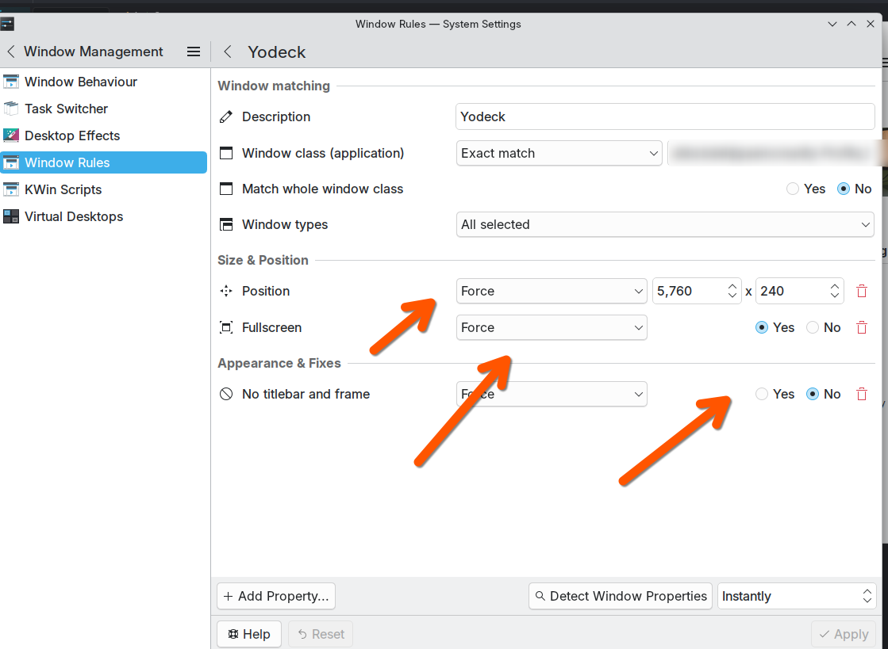

# Heads Up Dashboard Display Planning Notes - 09/25

- Documentation: Sep 9th, 2025

## What I'm Working On

A simple dashboard to display on a 7 inch monitor which I purchased to monitor our newborn:

The objective: display essential information on a screen that's used exclusively for this puropse with a KDE Window Rule. Something like this:

## Why It's On Github

Collaboration and explaning the idea.

## Doesn't This Exist?

I would happily pay $x/month (within reason - my SaaS budget hurts!). Or self host something. But - among a sea of dashboard projects - I'm having  a hard time finding a good fit. 

General observations:

- There are great digital display projects (Xibo, Yodeck, Anthias). But these are targeting a more complicated and different use-case: businesses don't typically want to embed personal Google Calendars or inboxes, for example! Financially these also tend to charger per screen: if you're a tech fiend with lots of devices you'd like to display on, what is a trivial expense for a startup quickly becomes a non-runner. Hence for what I'm trying to achieve, these often end up feeling "overpowered but also underpowered." 
- Another promising category is server homepages (think: Heimdall etc). The problem here is that these tend to be pitched to home labbers and often have a strong anti-Google bend with widgets that support everything *but* common SaaS / non-self-hosted productivity tools. These are great for what they do but are not quite the tool for what I'm looking for.
- Rasperry Pi projects: I own a Rasperry Pi and several Orange Pis and thought about recommisioning one for Dakboard (etc) but the idea doesn't make much sense to me: if you create a great dashboard, why bind it to a physical piece of hardware? Web UIs can be protected via Cloudflare, etc, and a web UI is just about the most hardware-agnostic way to create a frontend. This seems like the much more logical approach to me. 

My problem - maybe that of many - is that what I *want* straddles a few traditional software divisions: I want elements of NVR (to watch video feeds), Google Calendar integrated embed objects, and off-the-shelf widgets. 

So ... I'm DYI-ing.

---

## My Personal Dashboard

I recently became a father to a wonderful little man. I'm also something of a night owl (understatement of the century). 

There are currently two things I want in my heads up display:

- At night time, a way to glance at my IP cam to make sure that our dear one is okay. 
- During the day, an embed of my Google Calendar so that I can check my schedule and see when my next meeting is.

Very useful: next meeting in X. Where X is the time in hours and minutes.

I'd also love: previews of my inboxes or feeds (I use two Google Workspaces, one for personal and the other for business; hence everything comes in twos).

## Other Dashboard Elements

Other useful things for me:

### News Feeds For Situational Awareness:

- I live in Israel. Red Alert is our national rocket alert system. There are a few third-party implementations, but the official one is protected by geofencing. This makes it challenging to add in off the shelf dashboard builders which create embed objects from non-Israeli IPs. This is another reason why I want to create something locally deployed.
- Google News. My philosophy about news consumption especially in a conflict zone: less is more. Ideally the top items on the national agenda (proxy: Google News top stories, Isreal English), a trusted RSS feed (Times of Israel), and a location-specific one for Jerusalem. 

- The weather: today, tomorrow; condition, temperature (celsius) and chance of precipitation (if not raining). Other climatic things which are helpful to know: PM2.5 at a local station (color coded), whether it's warmer than 35C (ie, VERY hot even by local standards!), and whether it's below 2C and plants might need to be taken in. 

## Time Display

I love UTC not because I spent time in the military (I didn't) but because I'm both a recovering aviation geek and frequently work with people in different time zones. UTC creates a single deterministic global time. 

I'm also an ADHDer with a weird brain: I hate clocks with seconds displays as I find them distracting. But hours and minutes are A-okay. 

I also like to see the date displayed in another weird format, like: `Mon, 09th Sep (09) 2025`. I like dd/mm/yyyy and this format is one I've stuck with to provide all the key details. If space is at a premium I hope that I retain enough sanity to remember the year and go, instead, with `Mon, 09th Sep (09)`. I can never remember - including now - how these are notated in MementoJS.